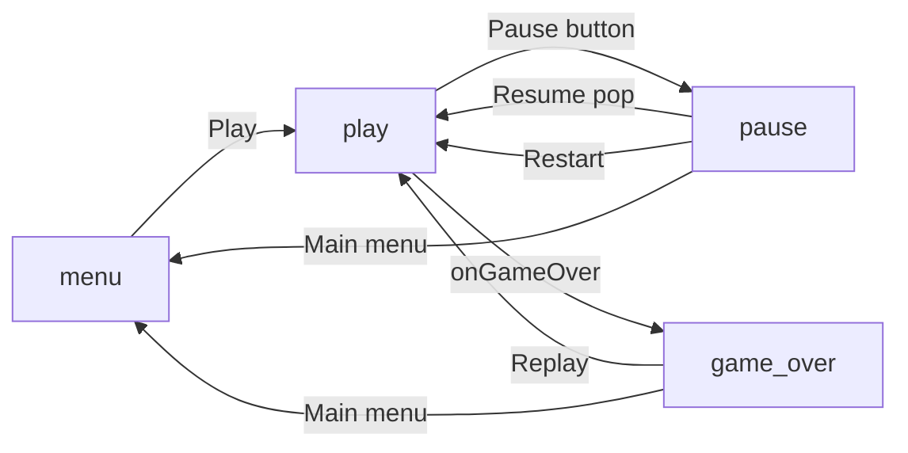

# Flame Casual Game Boilerplate

A **starter template** for 2D casual games built with [Flutter](https://flutter.dev/) and [Flame](https://flame-engine.org/). It is meant for teams who want to ship gameplay fast: routing between **main menu**, **gameplay**, **pause**, and **game over** is already wired, with shared UI primitives and hooks for audio, persistence, and optional BLoC state.

Use this repo as a **GitHub template** or clone it, rename the app, then customize the four screens and plug in your own `GameplayDelegate`.

---

## What you get

- **Flame `RouterComponent`** with named routes: `menu`, `play`, `pause`, `game_over`.
- **Sample game** (`ColorMatchDelegate`) showing how gameplay lives behind a single delegate interface.
- **Reusable in-game UI**: gradient backgrounds, styled buttons, pause dim overlay (`lib/game/ui/`).
- **Services**: `get_it` DI, `LocalStorage` (high scores per game id), `AudioController` (BGM/SFX respecting settings).
- **Flutter shell**: `GameWidget`, Material app, `flutter_bloc` providers for settings and score (usable from Flutter overlays if you add them later).
- **Localization** scaffold via `gen_l10n` (`lib/l10n/`).

---

## Quick start

1. Clone or use this repository as a template for a new project.
2. Run `flutter pub get`.
3. Run the app: `flutter run` (or your IDE run action).

The game boots into **`MainMenuRoute`** (`initialRoute: 'menu'` in `MyCasualGame`).

---

## Project layout

| Path                                    | Role                                                                                                   |
| --------------------------------------- | ------------------------------------------------------------------------------------------------------ |
| `lib/main.dart`                         | App entry, `GameWidget.controlled(gameFactory: MyCasualGame.new)`, BLoC providers.                     |
| `lib/game/my_casual_game.dart`          | `FlameGame` subclass, `GameType` enum, router table, `lastScore` / `lastGameWon` for game-over screen. |
| `lib/game/routes/`                      | One component per screen: menu, gameplay, pause, game over.                                            |
| `lib/game/ui/`                          | `MenuButton`, `BackgroundGradient`, `DimOverlay`.                                                      |
| `lib/game/config/game_type_config.dart` | Per–game-type display name and menu gradient (`GameCardColors`).                                       |
| `lib/features/gameplay/`                | `GameplayDelegate` + concrete games (e.g. `color_match/color_match_delegate.dart`).                    |
| `lib/core/`                             | DI (`locator.dart`), `LocalStorage`.                                                                   |
| `lib/features/`                         | Audio, settings, score cubits.                                                                         |

---

## Router flow



- **Pause** is pushed on top of gameplay (`pushNamed('pause')`), so `pop()` returns to the same run.
- **Game over** uses `pushReplacementNamed('game_over')` so the previous gameplay route is not kept (`game_over` route uses `maintainState: false`).

---

## Customizing menu, pause, and game over

All of these are **Flame components** under `lib/game/routes/`. Adjust layout in `onGameResize`, copy styling from existing `TextComponent` / `TextPaint` blocks, or swap components.

### Main menu — `main_menu_route.dart`

- **Background**: `BackgroundGradient` with `colorsResolver` reading `GameType.colorMatch.cardColors` (change when you add modes in `game_type_config.dart`).
- **Title / high score**: `onMount` sets text from `GameType...displayName` and `LocalStorage.getHighScore(gameName)` where `gameName` is the enum’s `.name` (e.g. `colorMatch`).
- **Play**: `PlayButton` extends `MenuButton` and calls `game.router.pushReplacementNamed('play')`.

### Pause — `pause_route.dart`

- **Dim layer**: `DimOverlay` (from `background_gradient.dart`) covers the full viewport; gameplay stays underneath but does not update while this route is active.
- **Buttons**: Resume (`pop()`), Restart (`pop` then `pushReplacementNamed('play')`), Main menu (`pop` then `pushReplacementNamed('menu')`).

### Game over — `game_over_route.dart`

- Reads `game.lastScore` and `game.lastGameWon` set by `GameplayRoute` before navigating.
- Persists high score via `LocalStorage.setHighScore(gameName, score)` when the run beats the previous best.
- **Important**: use the **same** `gameName` key as the main menu (`GameType.yourMode.name`) so high scores stay consistent.

### Shared buttons and colors

- **`MenuButton`** (`menu_button.dart`): primary/secondary gradient styles; subclass and implement `onTap()` like the existing `*Button` classes.
- **`MenuButtonColors`**: edit static colors to retheme all menu-style buttons at once.

---

## Adding or replacing gameplay

### 1. `GameplayDelegate`

Gameplay for a mode is a **`GameplayDelegate`** (`lib/features/gameplay/gameplay_delegate.dart`): a `PositionComponent` with:

- `onGameOver(bool isWin, int score)` — call when the round ends; the route handler sets `game.lastScore` / `game.lastGameWon` and opens `game_over`.
- `onScoreUpdated(int score)` — optional HUD updates.
- `reset()` — called from `GameplayRoute.onMount` when a new run starts.
- Optional hooks: `onGameStart`, `onGamePause`, `onGameResume` (override if you need them).

The sample **`ColorMatchDelegate`** shows a full implementation: layout in `onGameResize`, logic in `update`, and calling `onGameOver` / `onScoreUpdated` at the right times.

### 2. Wire the delegate — `gameplay_route.dart`

- Instantiate your delegate in `onLoad` (replace or switch on `GameType` if you add multiple modes).
- Keep the existing `onGameOver` callback pattern so audio and router behavior stay consistent.
- Preload audio in `onLoad` / `FlameAudio` as needed; start/stop BGM in `onMount` / `onRemove`.
- **`PauseButton`** in this file opens the pause route; reposition it in `onGameResize` if you change safe areas.

### 3. Branding and high scores — `GameType` + `game_type_config.dart`

- Add enum values in `my_casual_game.dart`.
- Extend `displayName` and `cardColors` in `game_type_config.dart` for menu title and gradient.
- Point **main menu** and **game over** at the active `GameType` for `gameName` / display strings (today they reference `GameType.colorMatch` directly; with multiple modes you would pass the selected type from the game instance).

For a longer checklist (multiple games on a selection screen, assets, etc.), see the project skill **Add New Game** at `.cursor/skills/add-new-game/SKILL.md` and align it with your current router if the skill mentions routes your fork does not use.

---

## Using shared services

### Audio

`AudioController` is registered in `get_it`:

```dart
getIt<AudioController>().playBgm('background.mp3');
getIt<AudioController>().playSfx('ting.mp3');
getIt<AudioController>().stopBgm();
```

Place files under `assets/audio/` and list them in `pubspec.yaml` if you add new paths.

### Settings and score (BLoC)

From Flutter widgets (not from Flame components unless you pass callbacks/context):

```dart
context.read<SettingsCubit>().toggleSound();
context.read<ScoreCubit>().addScore(10);
```

Gameplay in this template typically updates score through the delegate callbacks or local state; use cubits when you surface score in Flutter overlays.

### Localization

Add strings to `lib/l10n/app_en.arb`, then use `AppLocalizations.of(context)!` in Flutter. Flame `TextComponent` uses `TextPaint` / `TextStyle` directly; wire localized strings by passing them from Flutter into the game or by duplicating keys in a small shared map if you need l10n on Flame text.

---

## Optional project hygiene

- Rename `MyCasualGame`, `flame_boilerplate`, and Android/iOS bundle identifiers to match your product.
- Replace sample assets under `assets/` with your art and audio.
- Add a dedicated **loading** route if you need a heavy preload step before `menu`; register it in `MyCasualGame`’s `routes` map and set `initialRoute` accordingly.

---

## License

Use and modify this boilerplate per your team’s policy; refer to repository license if one is added.
